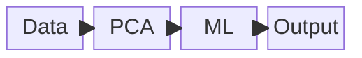

# Introduction

## Small data

**Big data** refers to having many observations, for a certain number of features. 
In many real world cases, however, a problem may have many features and few observations. 
In this case, which we denote as **small data**, traditional ML methods may struggle with generalisation. 

Consider the following synthetic example, based on a bioinformatics problem.
100 genes (features) have been measured, and we know there is a way to easily distinguish which point should be blue or orange. This can be done by looking at two features only.
You can use the sliders to select two dimensions to plot. Can you spot which features are the relevant ones?

<div class="eon-figure" id="hidden-dimensions"></div>

??? tip "Reveal the answer"

    Check features **19** and **72**.

This is a simple example to illustrate that even if the information is present and sufficient for perfect discrimination, it may require solving a needle in a haystack problem. 
In the situation above, there are almost 5000 feature pairs that can be inspected, and only _one_ of them is useful.
Few observations lead to even more accentuated issues.

## Pipelining

Traditional ML methods involve combining different steps in a sequence, or _pipeline_.
For the high-dimensional example described above, for instance, Principal Component Analysis could be applied to the data, before passing the data to an ML algorithm.



However, PCA and the ML algorithm are not intrinsically linked: the former is an unsupervised technique, and as such it is not aware of the downstream classification task. 
Important information could be hidden in dimensions with small variance, which are dropped by PCA.
  
Consider the narrow cloud below. The blue and orange points differ across its short direction, while both classes have the same distribution along its long direction.
PCA with one component keeps the latter, as it explains most of the variance. 
The projected classes then overlap, while the discarded component would have been able to separate them.

<div class="eon-figure" id="pca-label-loss"></div>

## What is entropic learning?

Entropic learning is a framework that originated from the work of Prof. Horenko's lab.
The idea is simple: all the steps can be combined as a single optimisation problem.
For example, if feature selection is included in the ML algorithm, there is no need for a separate and blind preprocessing step.

To achieve this, all parts of the learning task have to be defined mathematically.
In the [eSPA+ paper](#espa), the following steps were combined:

- Discretisation of the state space using a set of centroids
- Bayesian labelling of the centroids
- Identification of the relevant features

### eSPA+ walkthrough
In this section, we will describe how eSPA+ combines the three steps into a single problem. 
Note that eSPA+ can be considered as a special case of EON, which is provided in this package, and the explanation is meant to give an idea if you have never heard of the technique.
If you are familiar with eSPA+ or you are not afraid of jumping into the mathematics, feel free to visit the [Concepts](../concepts/index.md) pages.

Consider $T$ observations of $D$ features for a classification problem with $M$ classes.
We will identify $K$ clusters in our model, used to represent the observations.
In fact, the quality with which an observation can be reconstructed by the $k$th centroid $C_{k,:}$ can be measured with weighted squared distance:

$$
d_{t,k} = \sum_{d=1}^D W_d (X_{t,d} - C_{k,d})^2
$$

where each feature has a non-negative weight $W_d$ and all weights sum to one.

Assignment of points to clusters can be collected into a matrix $\Gamma \in \{0,1\}^{T \times K}$, where $\Gamma_{t,k} = 1$ if the $t$th point is affiliated with the $k$th cluster.
Each cluster has a distribution over the output classes collecting the conditional probabilities $\Theta_{m,k}$ that a point in cluster $k$ belongs to the $m$th class. 

Furthermore, we can add a regularisation term on the *entropy* of $W$ to bias the solution towards more or less sparse solutions in terms of feature weights.

Combining everything, we can write a joint loss:

$$
L = \underbrace{\frac{1}{T} \sum_{t,k} \Gamma_{t,k} d_{t,k}}_{\text{discretisation}}
\;\underbrace{-\frac{\delta}{T} \sum_{t,k,m} \Gamma_{t,k} \Pi_{t,m} \log \Theta_{m,k}}_{\text{labelling}}
\;\underbrace{+\varepsilon_D \sum_{d} W_d \log(W_d)}_{\text{feature selection}}.
$$

The first term captures how well the discretisation can describe the original data.
The second term steers towards affiliations and conditional probabilities that are close to the true label probability distributions $\Pi \in [0,1]^{T \times M}$, with $\delta$ being the regularisation factor that controls the strength of this effect.
The last term is the negative entropy. Small values of $\varepsilon_D$ concentrate the weights on a single or few features, whereas larger values result in equally weighted features.

Training a model can be performed via coordinate descent one parameter at a time, while keeping everything else fixed. This can be performed as a sequence of **closed-form analytical solutions**, during which the loss never increases. 

In the [Concepts](../concepts/index.md), this will be expanded to a general problem, which can be solved with EON.

## Literature

EON builds on a line of research in entropy-optimal methods.
SPA solves discretisation, feature selection and prediction as one problem.
eSPA reformulates SPA for classification, and eSPA+ is the variant of eSPA with hard affiliations.
EON generalises eSPA+ with hidden blocks, soft affiliations and instance weights.
EOMC is a related method for learning manifolds, and the package's [manifold input](manifold.md) generalises it to EON models.

### EON — Entropy-Optimal Networks

Bassetti, D., Pospíšil, L., Groom, M., O'Kane, T. J., & Horenko, I. (2025).
*An entropy-optimal path to humble AI.* arXiv:2506.17940.
[arxiv.org/abs/2506.17940](https://arxiv.org/abs/2506.17940)

??? quote "BibTeX"

    ```bibtex
    @article{bassetti2025eon,
      title   = {An entropy-optimal path to humble {AI}},
      author  = {Bassetti, Davide and Pospíšil, Lukáš and Groom, Michael and
                 O'Kane, Terence J. and Horenko, Illia},
      journal = {arXiv preprint arXiv:2506.17940},
      year    = {2025},
      doi     = {10.48550/arXiv.2506.17940}
    }
    ```

### EOMC — Entropy-Optimal Manifold Clustering

Horenko, I. (2025). *Linearly-scalable and entropy-optimal learning of nonstationary and
nonlinear manifolds.* arXiv:2512.17926.
[arxiv.org/abs/2512.17926](https://arxiv.org/abs/2512.17926)

??? quote "BibTeX"

    ```bibtex
    @article{horenko2025eomc,
      title   = {Linearly-scalable and entropy-optimal learning of nonstationary
                 and nonlinear manifolds},
      author  = {Horenko, Illia},
      journal = {arXiv preprint arXiv:2512.17926},
      year    = {2025},
      doi     = {10.48550/arXiv.2512.17926}
    }
    ```

### SPA — Scalable Probabilistic Approximation

Gerber, S., Pospíšil, L., Navandar, M., & Horenko, I. (2020).
*Low-cost scalable discretisation, prediction, and feature selection for complex
systems.* Science Advances, 6(5), eaaw0961.
[doi.org/10.1126/sciadv.aaw0961](https://doi.org/10.1126/sciadv.aaw0961)

??? quote "BibTeX"

    ```bibtex
    @article{gerber2020spa,
      title   = {Low-cost scalable discretisation, prediction, and feature
                 selection for complex systems},
      author  = {Gerber, S. and Pospíšil, L. and Navandar, M. and Horenko, I.},
      journal = {Science Advances},
      volume  = {6},
      number  = {5},
      pages   = {eaaw0961},
      year    = {2020},
      doi     = {10.1126/sciadv.aaw0961}
    }
    ```

### eSPA — entropy-optimal SPA

Horenko, I. (2020). *On a Scalable Entropic Breaching of the Overfitting Barrier for
Small Data Problems in Machine Learning.* Neural Computation, 32(8), 1563–1579.
[doi.org/10.1162/neco_a_01296](https://doi.org/10.1162/neco_a_01296) ·
[arXiv:2002.03176](https://arxiv.org/abs/2002.03176)

??? quote "BibTeX"

    ```bibtex
    @article{horenko2020espa,
      title   = {On a Scalable Entropic Breaching of the Overfitting Barrier
                 for Small Data Problems in Machine Learning},
      author  = {Horenko, Illia},
      journal = {Neural Computation},
      volume  = {32},
      number  = {8},
      pages   = {1563--1579},
      year    = {2020},
      doi     = {10.1162/neco_a_01296}
    }
    ```

### eSPA+

Vecchi, E., Pospíšil, L., Albrecht, S., O'Kane, T. J., & Horenko, I. (2022).
*eSPA+: Scalable Entropy-Optimal Machine Learning Classification for Small Data
Problems.* Neural Computation, 34(5), 1220–1255.
[doi.org/10.1162/neco_a_01490](https://doi.org/10.1162/neco_a_01490)

??? quote "BibTeX"

    ```bibtex
    @article{vecchi2022espaplus,
      title   = {eSPA+: Scalable Entropy-Optimal Machine Learning Classification
                 for Small Data Problems},
      author  = {Vecchi, Edoardo and Pospíšil, Lukáš and Albrecht, Steffen and
                 O'Kane, Terence J. and Horenko, Illia},
      journal = {Neural Computation},
      volume  = {34},
      number  = {5},
      pages   = {1220--1255},
      year    = {2022},
      doi     = {10.1162/neco_a_01490}
    }
    ```

### SPARTAN

Horenko, I., Vecchi, E., Kardoš, J., Wächter, A., Schenk, O., O'Kane, T. J., Gagliardini,
P., & Gerber, S. (2023).
*On cheap entropy-sparsified regression learning.* Proceedings of the National Academy
of Sciences, 120(1), e2214972120.
[doi.org/10.1073/pnas.2214972120](https://www.pnas.org/doi/10.1073/pnas.2214972120)

??? quote "BibTeX"

    ```bibtex
    @article{horenko2023spartan,
      title   = {On cheap entropy-sparsified regression learning},
      author  = {Horenko, Illia and Vecchi, Edoardo and Kardoš, Juraj and
                 W{\"a}chter, Andreas and Schenk, Olaf and O'Kane, Terence J. and
                 Gagliardini, Patrick and Gerber, Susanne},
      journal = {Proceedings of the National Academy of Sciences},
      volume  = {120},
      number  = {1},
      pages   = {e2214972120},
      year    = {2023},
      doi     = {10.1073/pnas.2214972120}
    }
    ```

### EOS — Entropic Outlier Sparsification

Horenko, I. (2022).
*Cheap robust learning of data anomalies with analytically solvable entropic outlier
sparsification.* Proceedings of the National Academy of Sciences, 119(9), e2119659119.
[doi.org/10.1073/pnas.2119659119](https://www.pnas.org/doi/10.1073/pnas.2119659119)

??? quote "BibTeX"

    ```bibtex
    @article{horenko2022eos,
      title   = {Cheap robust learning of data anomalies with analytically
                 solvable entropic outlier sparsification},
      author  = {Horenko, Illia},
      journal = {Proceedings of the National Academy of Sciences},
      volume  = {119},
      number  = {9},
      pages   = {e2119659119},
      year    = {2022},
      doi     = {10.1073/pnas.2119659119}
    }
    ```

### Julia reference implementation

[EntropicLearning/eSPA.jl](https://github.com/EntropicLearning/eSPA.jl) — a Julia
implementation of eSPA and eSPA+.

## Where to go next

- [Introduction to the package](package.md) connects these ideas to the public interfaces.
- [Fit your first network](../tutorials/series.md#tutorial-1) is the hands-on starting point.
- [Manifold](manifold.md) introduces local subspaces after the basic model.
