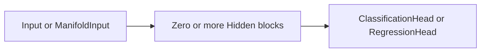

# Package and Recipes 

This page introduces the package interfaces and shows how to create Recipes.

## Recipes, Networks and estimators

In order to maintain a clear separation of responsibility, we offer three main objects that you should get familiar with.
A `Recipe` contains a blueprint for the model, including the sequence of blocks, how they are connected and their settings. This is an operative description of everything needed to reproduce a model.

There are two ways of creating a model:

- A `Network` is the lower-level object that can be used to fit (tensor) data
- The estimators `EONClassifier` and `EONRegressor` are higher level objects that are compliant with the scikit-learn interface.

## How an estimator relates to a Network
An estimator wraps a `Network`, available as `network_` after fitting.

The main difference is the inclusion of extra utilities and convenience functions.
A `Network` is bare-bones and allows a higher level of control, whereas an estimator is more user-friendly.

In fact, a `Network` operates directly on tensors, so you are responsible for moving the data to the correct device, keeping track of the named columns, handling the class labels and so on (see [Using Networks](networks.md)).
On the other hand, if you _just want to fit a model_ instead, an estimator will take care of this for you.

An estimator is not a second implementation of the model.
It converts NumPy arrays or DataFrames, records the column meanings and encodes the categories, then leaves the fitting, the prediction and every calculation on the fitted model to its `Network`.
Its results are converted back to the original labels and columns.

When should you use a `Network` directly? Start with an estimator, and use a `Network` when you need:

- to fit or predict with tensors that are already on the right device;
- the affiliations of each block, or the predictions of each retained member;
- direct continuation, fine-tuning, retention controls or the `.safetensors` format (see [Using Networks](networks.md#save-the-network));
- a custom initial state, or a control the estimator does not expose.

For routine inspection, prefer the estimator's own methods: going through `network_` to repeat one of them loses the column and label mappings.

## What is needed to define a model?

Everything can be defined using a `Recipe`, an immutable description of a model.

??? question "What do you mean by 'immutable'?"

    It means that a `Recipe` cannot be changed once it is built: what you specify is exactly what the model is fitted with. To change a setting, you create a new `Recipe` from an existing one, see [Setting parameters](#setting-parameters).

We also offer convenience functions for quickly creating recipes, for example if a sequence of blocks is desired, the corresponding recipe can be created as follows:

```python
from entlearn import ClassificationHead, Input, Recipe

recipe = Recipe.chain(
    Input(K=8, epsilon=0.015, epsilon_D=0.01, name="features"),
    ClassificationHead(),
)
```

## Block types

There are three types of blocks, depending on their role in the model: input, hidden and output.
A model starts with an input block and ends with an output block. Hidden blocks can be added between them.

### Input

The input block describes an interface to the data. There are currently two choices:

- `Input` represents the observations using `K` centroids. It supports continuous and categorical features, and can learn feature and instance weights when the corresponding temperatures are enabled.
- `ManifoldInput` implements the EOMC approach. Each cluster has a centroid and a local linear subspace, allowing the model to represent data using a combination of linear manifolds. It supports continuous features and can learn instance weights, but has no feature-weight parameter. See [Manifold](manifold.md) for more details.

### Hidden

`Hidden` adds another clustering block on the probabilistic representations, with its own number of clusters `K` and affiliation temperature `epsilon`.
It is connected to the neighbouring blocks through learned transition matrices, so its affiliations are fitted together with the rest of the model.
Hidden blocks are optional: inputs can be directly connected to outputs.

### Output

The output block, also called a **head**, depends on the task you want to solve:

- `ClassificationHead` is used to predict classes, in classification tasks.
- `RegressionHead` is used to predict continuous values. It supports a single target or several simultaneous output dimensions.

These objects describe the model to fit. The fitted `Network` holds the learned values.
You can give each block a `name`, such as `name="features"` in the example above. These names identify the blocks when inspecting the model or changing its parameters.
The [Recipe reference](../reference/recipe.md) lists the settings available for each block.

## What shapes can a model have?

A `Recipe` can describe any directed acyclic graph of blocks and connections, but a `Network` can currently fit only a **chain**:



A recipe with a skip connection, a join, several inputs or several heads is still a valid description, but fitting it raises a `ValueError`.
`Recipe.chain` always builds a shape that can be fitted.

Since fitting never changes a `Recipe`, the same recipe can be reused, cloned and compared across fits.

## Setting parameters

Parameters such as the number of clusters ($K$) and the temperatures belong to the `Recipe`. Training settings, such as the maximum number of iterations, are instead passed when fitting a model.


New `Recipe` objects can be obtained from existing ones, as illustrated below: 

```python
# Using the recipe created in the previous example
changed_recipe = recipe.replace_block("features", K=12)
```

Similarly, connections can be changed using `recipe.replace_connection`.


Use `set_params` to change an estimator’s parameters through the scikit-learn interface.

```python
from entlearn.scikit_adapter import EONClassifier

estimator = EONClassifier(recipe, max_iter=100, random_state=7)
estimator.set_params(recipe__blocks__features__K=12)
```

This operation changes the estimator's configuration directly.
Every parameter is exposed and can be reached through the `recipe__*` syntax.
For example, the path `recipe__blocks__features__K` selects the parameter `K` of the block named `features`. Connection parameters follow the pattern `recipe__connections__<name>__<parameter>`.
Settings such as `max_iter` belong directly to the estimator and therefore *need no prefix*. You can inspect the available parameters with `estimator.get_params()`.

If you are using a `Network`, you can simply pass the modified recipe when fitting it:

```python
from entlearn import Network

network = Network.fit(changed_recipe, X, y, max_iter=200, seed=7)
```

!!! note "Refit after a change"
    Changing a recipe or calling `set_params` does not update an already fitted model. You must refit the `Network` to use the new `Recipe`.

For more examples of which hyperparameters can be configured and the effects of doing so, see [Hyperparameters](hyperparameters.md).
